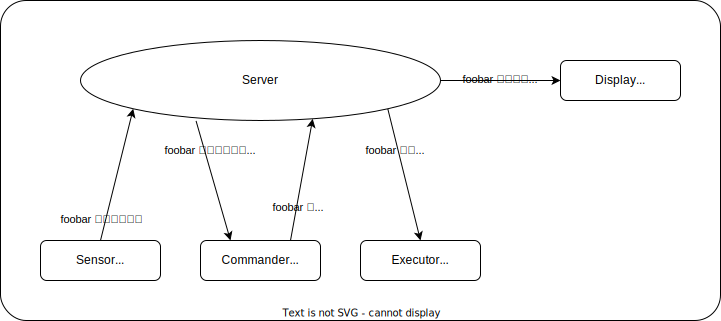

# クライアント

サーバーに接続するアプリケーションのことです。

* TOC
{:toc}

## クライアント ID

クライアント ID は、サーバーがクライアントを識別するために使用する ID です。

この ID の実体は `unsigned int 32bit` です。

## クライアントユーザー

そのクライアントが属するユーザーです。

Sensor が送信するデータがどのユーザーのものなのか、 Controller はどのユーザーに対して Execute するのかなどの指定に使います。

全てのユーザーに対して有効とする場合、空文字 `""` を表明します。

### Sensor にとってのユーザー

送信するデータが誰のデータなのかを表明します。

### Controller にとってのユーザー

ユーザー名を指定した場合、同じユーザー名からのセンサーデータのみを受け取ります（厳密にはサーバーでフィルタリングを行います）。

ユーザー名を空文字にした場合は全てのユーザーのセンサーデータを受け取ります。

### Executor にとってのユーザー

Controller が出す指示の宛先として利用されます。

### Display にとってのユーザー

ユーザー名を指定した場合、その人に関するデータのみを受信します（厳密にはサーバーでフィルタリングを行います）。

## クライアントモード

| mode      | uint8 value | description                                                                                       |
| --------- | ----------- | ------------------------------------------------------------------------------------------------- |
| sensor    | 0           | [Sensor](../client/sensor/index.md) ANT+ センサーや HID など.                                     |
| commander | 1           | [Commander](../client/commander/index.md) センサーの値をもとにゲームをコントロールするプログラム. |
| executor  | 2           | [Executor](../client/executor/index.md) 指示に基づいて実行する.                                   |
| display   | 3           | [Display](../client/display/) ディスプレイ. UI など.                                              |
