# サーバーへの接続方法

サーバーとクライアントの通信には、 TCP Socket か Websocket を選択できます。

[クライアント ID についてはこちら](client.md#クライアント-id)

## TCP 接続方法

以下, StoC はサーバーからクライアント, CtoS はクライアントからサーバーの通信とします.



1. クライアントはサーバーへ Socket 接続を行います.
1. クライアントはその Socket を通じて, 4bytes の `00 00 00 00` を送信します.
1. サーバーはそれを新しいクライアントからの接続として認識し, 以降 StoC Socket として利用します.
1. サーバーは StoC Socket へ, クライアントに割り当てた ClientID 4bytes を送信します.
1. クライアントはその ClientID 4bytes を受け取ります.
1. クライアントはサーバーへ新たに Socket 接続を行います.
1. クライアントはその Socket に, 割り当てられた ClientID 4bytes を送信します.
1. サーバーは送られてきた ClientID 4bytes をもとに, StoC Socket とのペアリングを行います.
1. 正しくペアリングできた場合, サーバーはこの Socket へ ClientID 4bytes をエコー返送し, その後は CtoS Socket としてデータ受信を待ちます.

クライアントサイドの python みたいな模擬コード

```python
socketStoC = Socket()
socketStoC.connect(address="localhost", port=12345)
socketStoC.send([0, 0, 0, 0])
resp = socketStoC.recv(4)
clientID = 0
for i in range(4):
    clientID |= (resp[i] << (i * 8))
socketCtoS = Socket()
socketCtoS.connect(address="localhost", port=12345)
socketCtoS.send(resp)  # 受け取ったのと同じバイト列
resp2 = socketCtoS.recv(4)
# 必要であれば
assert(resp == resp2)
```

## Websocket 接続方法

基本的には Websocket に繋ぐだけ

接続を確立したときに、 ClientID をサーバー側から送信します。

```json
{
    "clientID": <ClientID>
}
```

## （番外） HTTP Server

~~デバッグ向けに使用できる RestAPI と、デバッグ用の WebPage を用意しています。~~

API Server の使いどころが無かった（Web Debug Panel が良い感じに動く）ので、 RestAPI は廃止し、Web Debug Panel を Serve するだけの HTTP Server となりました。
