# クライアント

サーバーに接続するアプリケーションのことです。

-   TOC
    {:toc}

## クライアント ID

クライアント ID は、サーバーがクライアントを識別するために使用する ID です。

この ID の実体は `unsigned int 32bit` です。

## クライアントユーザー

そのクライアントが属するユーザーです。

Sensor が送信するデータがどのユーザーのものなのか、 Controller はどのユーザーに対して Execute するのかなどの指定に使います。

全てのユーザーに対して有効とする場合、空文字 `""` を表明します。

### Sensor にとってのユーザー

送信するデータが誰のデータなのかを表明します。

### Controller にとってのユーザー

ユーザー名を指定した場合、同じユーザー名からのセンサーデータのみを受け取ります（厳密にはサーバーでフィルタリングを行います）。

ユーザー名を空文字にした場合は全てのユーザーのセンサーデータを受け取ります。

### Executor にとってのユーザー

Controller が出す指示の宛先として利用されます。

### Display にとってのユーザー

ユーザー名を指定した場合、その人に関するデータのみを受信します（厳密にはサーバーでフィルタリングを行います）。

## クライアントモード

| mode       | uint8 value | description                                                           |
| ---------- | ----------- | --------------------------------------------------------------------- |
| sensor     | 0           | センサー. ANT+ センサーや HID など.                                   |
| controller | 1           | コントローラ. センサーの値をもとにゲームをコントロールするプログラム. |
| emulator   | 2           | アウトプット. ゲームに対して入力をエミュレートする.                   |
| display    | 3           | ディスプレイ. UI など.                                                |
