# Roadbike-Game Documentation

**_けんこうだいいち。_**

* TOC
{:toc}

## 構造

このシステムは、ひとつのサーバーと 4 つのクライアントタイプで構成されます。

### Server

全てのクライアントが接続するサーバー。
TCP Server / Websocket Server / HTTP Server を提供します。

サーバー/クライアントとの通信には TCP Socket か Websocket が利用できます。
HTTP Server はデバッグ用途と、デバッグ用の Debug Website のサーブ用に用意されています。

### Sensor

様々なデータを Publish するクライアント。クライアントからサーバーへのデータ送信が主な役目です。

[Sensor クライアント一覧はこちら](client/sensor/index.md)

### Commander

Sensor から送られてきたデータを元に操作を決定し、 Executor に操作を伝える、指示役です。

[Commander クライアント一覧はこちら](client/controller/index.md)

### Executor

Commander から送られてきた操作指示から、実際に操作を行います。

[Executor クライアント一覧はこちら](client/executor/index.md)

### Display

Sensor, Commander, Executor でやりとりされるデータから、何かしらの表示を行うクライアントです。
具体的にはデバッグ向け UI や、配信・動画向けの UI クライアントとして使われます。

[Display クライアント一覧はこちら](client/display/index.md)

## リポジトリ

実装周りのリポジトリは現在全て Private です。

### Roadbike-Game

このシステムを実装しているリポジトリです。

[https://github.com/ShiraoShotaro/roadbike-game](https://github.com/ShiraoShotaro/roadbike-game)

### antplus

ANT+ 周りの作業をしているリポジトリです。

[https://github.com/ShiraoShotaro/antplus](https://github.com/ShiraoShotaro/antplus)

### roadbike-mod-fabric

Minecraft 向けの Mod プロジェクトです。 TODO: コードネーム欲しいな

[https://github.com/shigeno-y/roadbike-mod-fabric](https://github.com/shigeno-y/roadbike-mod-fabric)

### minecraft-mod-seed

Minecraft 向けの Mod プロジェクト 「Seed」 です。次プロジェクト作るときは flower とかになるのかな。

リポジトリは未作成。

### roadbike-game-docs

このドキュメントのリポジトリです。これだけ唯一 public です。

[https://github.com/ShiraoShotaro/roadbike-game-docs](https://github.com/ShiraoShotaro/roadbike-game-docs)
